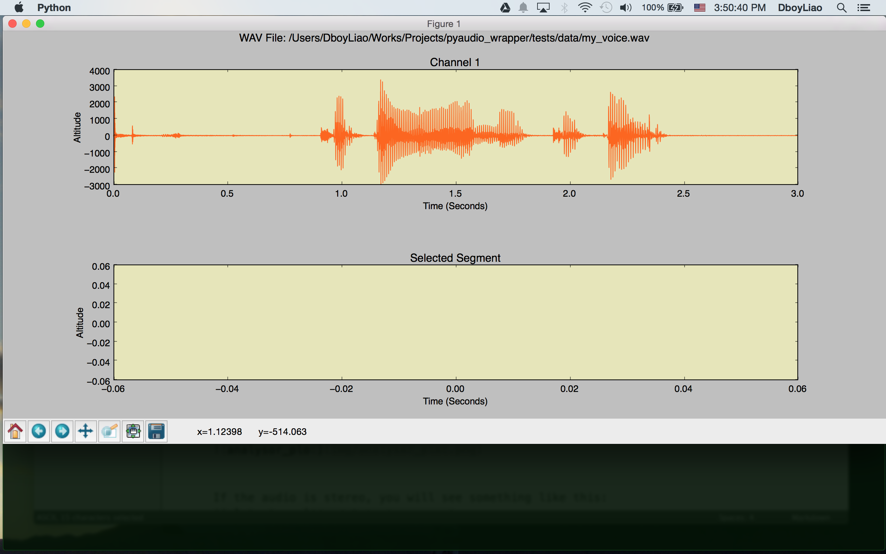
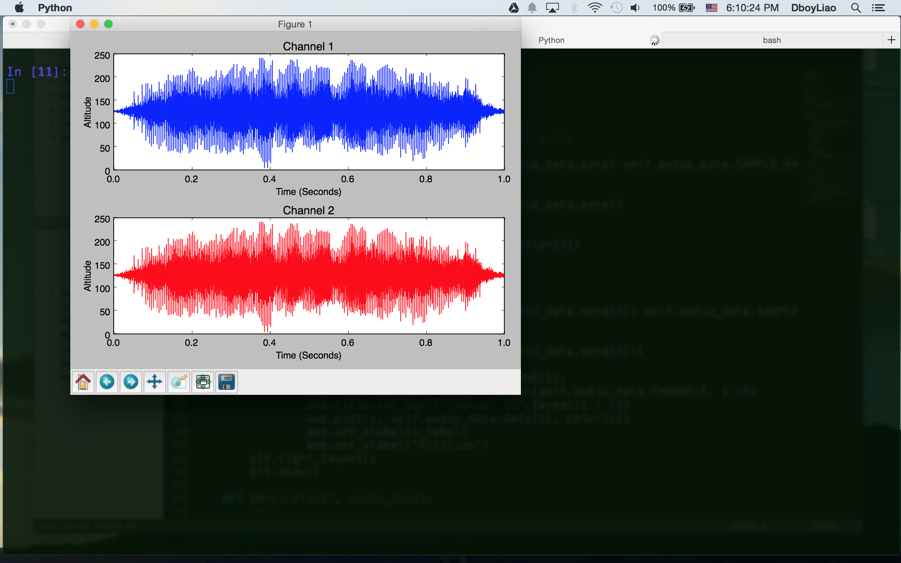
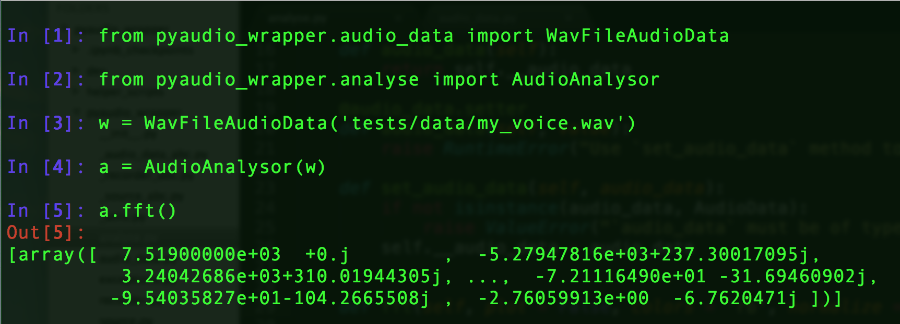
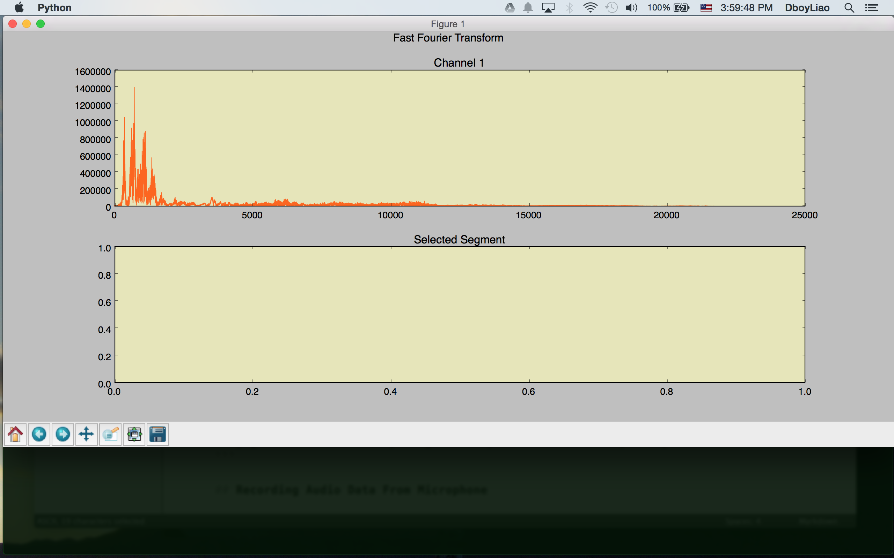
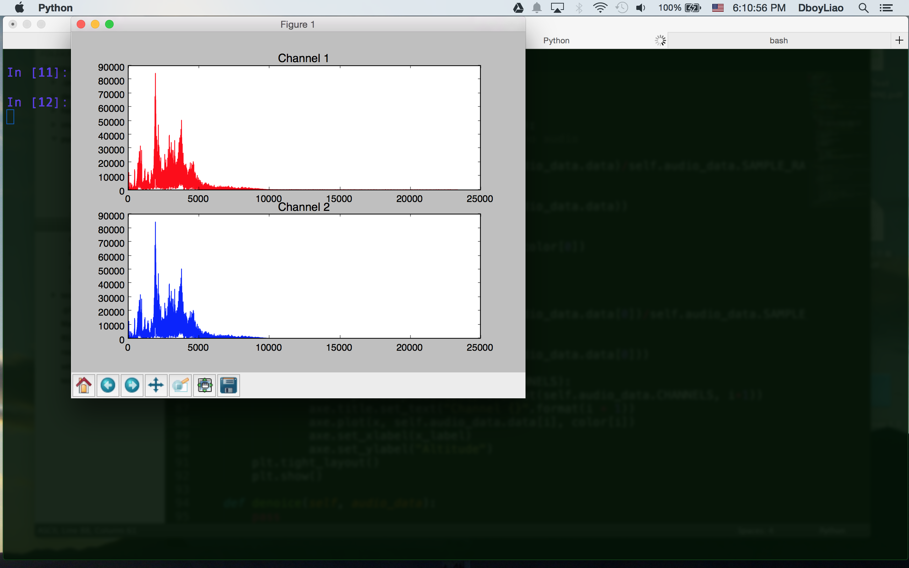

# A Simple Audio Wrapper of PyAudio

[`PyAudio`](https://people.csail.mit.edu/hubert/pyaudio/) is a python bindings for [`PortAudio`](http://www.portaudio.com/). However, the api, to my humble opinion, is not so friendly to the programmer who has no deep or comprehensive knowledge about audio data. This package is yet again another wrapper build upon `PyAudio` in order to provide a friendly api.

# Basic Usage

## Working with WAV Audio Data

```{python}
from pyaudio_wrapper.audio_data import WavFileAudioData

wav_audio = WavFileAudioData("tests/data/my_voice.wav")

wav_audio.raw_wav_data # Get the raw wav data in bytes.
wav_audio.duration     # duration of the audio file in seconds.
wav_audio.data         # A numpy array of the wav audio data.
wav_audio.play()       # Play out the audio.
wav_audio.play(start = 3, stop = 10) # Play the audio from 3 sec to 10 sec.
```

## Analyse Audio Data

```{python}
from pyaudio_wrapper.analyse import Analysor

analysor = Analysor(wav_audio)
analysor.plot() # plot the audio data.
```



If the audio is stereo, you will see something like this:


```{python}
coef = analysor.fft() # fast fourier transform.
```


```{python}
# Or you can plot the spectrum.
coef = analysor.fft(plot = True)
```


If the audio is stereo, you will see something like this:


## Recording Audio Data From Microphone (Still Buggy)

```{python}
from pyaudio_wrapper import Recorder
from pyaudio_wrapper.source import Microphone

recorder = Recorder() # Recording the sound from default microphone.
with Microphone() as source:
    wav_audio = recorder.record(source)

wav_audio.play()             # play out the audio.
wav_audio.data               # an numpy array of this audio data
wav_audio.save('record.wav') # save the audio as a wav file.
```

# Installation

```
git clone https://github.com/dboyliao/pyaudio_wrapper.git
cd pyaudio_wrapper
make install      # Run `make uninstall` if you want to uninstall this package.
```

# Troble Shooting

- The installation script works on my mac OS X 10.10.
- If you can not successfully install this package on OS X 10.10, you can try to re-install `python` with `brew`. That is, run `brew install python`.
- I use `docker` to test installation scripts with ubuntu. It can successfully install `portaudio` and `pyaudio` but once you instantiate `pyaudio.PyAudio`, `ALSA` breaks. I don't know why by now....
- I don't know how to install `portaudio` and `pyaudio` on Window. A little help here?

# Reference

- This package is inspired by the `speech_recognition` module by `Uberi`. [GitHub](https://github.com/Uberi/speech_recognition)
- [PyAudio](https://people.csail.mit.edu/hubert/pyaudio/docs/index.html#)
- [24-bits Scipy](https://github.com/scipy/scipy/issues/1930)
- [24-bits wave](http://stackoverflow.com/questions/16767248/how-do-i-write-a-24-bit-wav-file-in-python)
- [IOError](http://stackoverflow.com/questions/28174540/ioerror-errno-input-overflowed-9981)
- [plot](http://stackoverflow.com/questions/18625085/how-to-plot-a-wav-file), [fft](http://stackoverflow.com/questions/23377665/python-scipy-fft-wav-files), [fft2](http://docs.scipy.org/doc/scipy-dev/reference/tutorial/fftpack.html)
- [setup.py](http://stackoverflow.com/questions/15440115/how-would-i-run-a-script-file-as-part-of-the-python-setup-py-install)
- [pyaudio_mac](https://gist.github.com/jiaaro/9767512210a1d80a8a0d)
- [pydub](https://github.com/jiaaro/pydub)
- [avconv](http://www.tecmint.com/avconv-command-examples/)
- [avconv install](http://superuser.com/questions/568464/how-to-install-libav-avconv-on-osx)
- [unknown format](http://stackoverflow.com/questions/17297048/opening-a-wave-file-in-python-unknown-format-49-whats-going-wrong)
- [testing wav files](http://download.wavetlan.com/SVV/Media/HTTP/http-wav.htm)